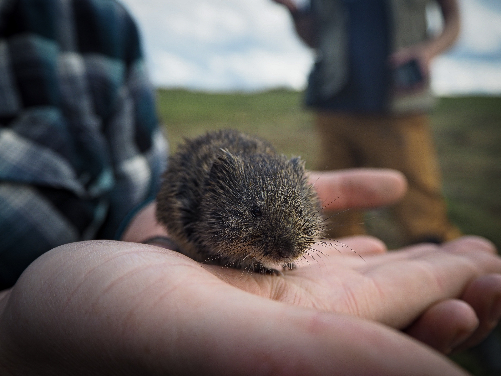

```{r setup, include=FALSE}
knitr::opts_chunk$set(echo = TRUE)
```


## Research projects 

- [Helpful R links](Rmd/Helpful-links.html)
- [Data tidying Notes](Rmd/data-tidying.html)
- [Rmarkdown lession](Rmd/Rmarkdownlesson.html)
- [Data visualization2](Rmd/Data-visualization.html)



*adorable tundra vole reporting for duty!*

```{r, echo=FALSE}
#in the code above ^ you can also paste links directly into ()

#To update the website you must update the .htmls
  #this means you must KNIT to update

#also can use #Blogdown to make a website, or #Bookdown
```


